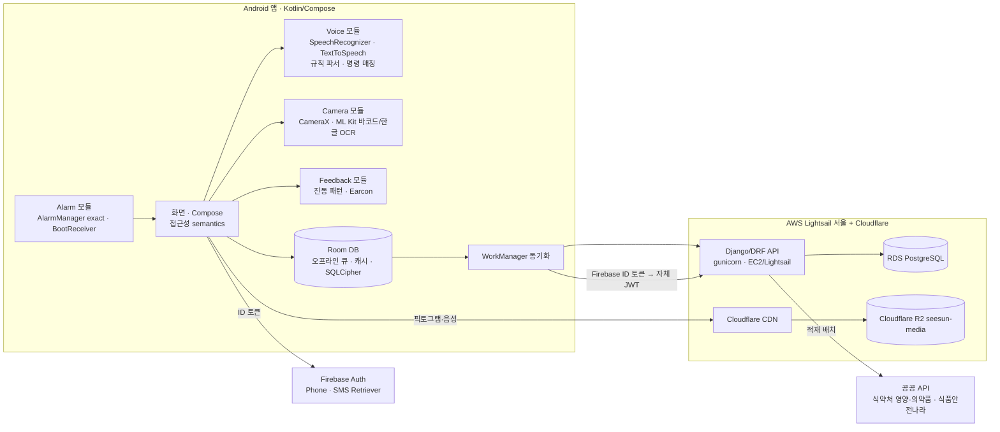
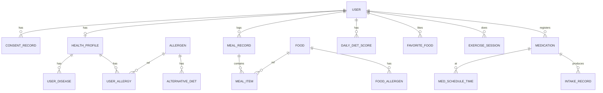

# 03. 아키텍처 설계 (to-be)

> 전제: D-03(Firebase Phone Auth), D-04(기기 내 음성 처리), D-07(AWS 서울 리전) 권장안.
> **D-01 확정:** Kotlin + Jetpack Compose(08 문서). 라이브러리 버전은 08 문서 §14가 기준입니다.

## 1. 전체 구조



**핵심 원칙**
1. **음성·사진은 기기 안에서 처리**합니다(STT/TTS/OCR/바코드). 서버로는 확인을 거친 **구조화 데이터만** 보냅니다 → 국외이전·요금·지연·연령 약관 문제를 한꺼번에 줄입니다.
2. **오프라인 우선:** 모든 기록(식사·운동·복용)은 Room에 먼저 저장하고 WorkManager가 멱등 API로 전송합니다(검수④).
3. **산식은 모듈화:** 목표 칼로리·식단 점수·당류 지표는 순수 함수 모듈(앱·서버 공용 명세 + 테스트 벡터)로 분리합니다(NFR-07).
4. **3차 확장 전제:** 알림·약·복용 기록 테이블과 앱 모듈 경계를 2차부터 잡아 둡니다.

## 2. 기술 스택

| 영역 | 선택 | 이유 |
|---|---|---|
| Android | Kotlin 2.4, Jetpack Compose(BOM 2026.09), AGP 9.4, minSdk 26 / **targetSdk 36** | 접근성 semantics 세밀 제어, Play 정책 |
| 아키텍처 | MVVM + 단방향 상태(UDF), Hilt, Coroutines/Flow, 모듈 분리(`:core:*`, `:feature:*`) | 3차 기능 추가 용이 |
| 로컬 DB | Room 2.8 + sqlcipher-android 4.19(민감정보 암호화) | 오프라인 큐, 건강정보 보호 |
| 네트워크 | Retrofit + OkHttp(인증 인터셉터·토큰 갱신 단일화) | 1차 B1 재발 방지 |
| 음성 | `SpeechRecognizer`(ko-KR, 가능 시 on-device), `TextToSpeech`, 규칙 기반 파서(숫자·날짜·전화·단위·끼니·섭취량) | Gemini 대체 |
| 카메라 | CameraX + ML Kit Barcode Scanning + Text Recognition(Korean) | 기기 내 처리 |
| 알림 | AlarmManager(`setAlarmClock`/`setExactAndAllowWhileIdle`) + `SCHEDULE_EXACT_ALARM` 허용 흐름(Android 14+ 기본 거부, `USE_EXACT_ALARM` 미사용), 전체화면 인텐트(허용 시, 아니면 heads-up + 반복 진동), BootReceiver·TimeChange 재등록 | 3차 검수③ |
| 인증 | Firebase Auth Phone(자동 인증·SMS Retriever) → 서버에서 ID 토큰 검증 후 자체 JWT 발급 | SMS 권한 불필요 |
| 백엔드 | Django 5.2 / DRF / SimpleJWT(회전·블랙리스트), gunicorn, (Channels·Celery는 필요 시만) | 1차 재사용 |
| DB | PostgreSQL 15(RDS), JSONB | 1차와 동일 |
| 스토리지 | Cloudflare R2 + CDN(전송비 무료, 공개 콘텐츠만) | 픽토그램·운동 음성(08 문서 §10.2) |
| 관측 | Sentry(앱·서버), 컨테이너 로그·Lightsail 경보 — **개인정보 스크러빙** | |
| CI/CD | GitHub Actions: 백엔드 pytest·lint, 앱 lint·unit test·assemble, 서명 APK 아티팩트 | |

## 3. Android 모듈 구성

```
android/
 ├─ app/                         # 진입점, 내비게이션 그래프
 ├─ core/
 │   ├─ designsystem/            # 색·타이포·공통 컴포넌트(마이크, 결과칸, 다음 버튼, 목록형 버튼, 스크롤 강조 목록, 음식 카드, 확인 화면, 경고 팝업)
 │   ├─ a11y/                    # 화면 진입 안내, TalkBack 감지, 포커스 관리, announce 유틸
 │   ├─ voice/                   # STT/TTS 래퍼, 파서, 음성 명령 라우터, 음성 답변(네/아니요/수정)
 │   ├─ feedback/                # 진동 패턴(저장/알레르기/당류 경고/당류 위험/로딩), earcon
 │   ├─ camera/                  # CameraX, ML Kit, 위치 안내
 │   ├─ data/                    # Room, Retrofit, 동기화 워커, 리포지토리
 │   ├─ domain/                  # 산식 모듈(목표 칼로리, 식단 점수, 당류 지표, 섭취량 환산)
 │   └─ consent/                 # 동의 상태, 권한 요청 흐름
 └─ feature/
     ├─ onboarding/  ├─ health/  ├─ main/  ├─ mypage/  ├─ settings/
     ├─ diet-record/ ├─ diet-recommend/ ├─ diet-report/
     ├─ exercise/                # 1차 기능 재구현(방식→목록→상세·재생, 루틴, 커스텀)
     └─ medication/              # 3차
```

## 4. 백엔드 변경 설계

### 4.1 앱 구성
| Django 앱 | 상태 | 변경 |
|---|---|---|
| `users` | 보강 | Firebase 토큰 교환 엔드포인트, PIN 제거(또는 비활성), 프로필 필드(목표·목표칼로리), 탈퇴 시 전체 파기, 로그인 throttle |
| `consents` | **신규** | 약관·처리방침·민감정보·국외이전 동의 버전·일시·방법·철회 이력 |
| `health` | **신규** | 질환(복수), 알레르기(마스터 테이블 + 사용자 선택 + 기타), 목표 |
| `nutrition` | **신규** | 음식 마스터(식약처 DB 적재), 영양성분, 식품 분류(음료 여부), 알레르기 성분·상태(확인/없음/불가), 대체 식단, 추천 태그 |
| `diet` | **신규** | 식사 기록(멱등 client_uuid), 일별 점수 스냅샷, 선호 식단 |
| `exercises` | 보강 | `ExerciseMedia.s3_key` 의미 정리(→ `section` 필드 분리), 문장별 타임스탬프 스크립트 모델, 즐겨찾기 API |
| `logs` | 보강 | 세션 벌크·멱등 업로드, 주간 운동 리포트 API, 로그 파일 원격 백업은 보류(서버 DB로 충분) |
| `medication` | **신규(3차)** | 약, 복용 스케줄(시간 목록), 복용 기록(예정/복용/누락), 통계 API |
| `stt` | **축소/폐기** | 기기 처리로 대체. 유지 시 인증·요청 제한·로그 스크러빙 필수 |

### 4.2 데이터 모델 (주요 엔티티)



| 엔티티 | 주요 필드 | 비고 |
|---|---|---|
| USER | id(UUID), phone(암호화·해시 색인), firebase_uid, name, birthdate, sex(M/F), height_cm, weight_kg, goal, target_kcal, settings(JSONB), is_profile_completed | 1차 User 확장 |
| CONSENT_RECORD | type(TOS/PRIVACY/SENSITIVE/OVERSEAS/MARKETING), version, agreed, method(touch/voice), at, withdrawn_at | 법적 요구 |
| HEALTH_PROFILE / USER_DISEASE / USER_ALLERGY | disease(DIABETES/HYPERTENSION), allergen_id 또는 free_text | **민감정보 동의 없으면 생성 안 함** |
| ALLERGEN | code, name_ko, display_order, active | 19종 + 추가 대비(데이터 관리) |
| FOOD | source(MFDS/FOODSAFETY/BARCODE/USER), name, serving_g, kcal, carb, protein, fat, sodium_mg, sugar_g, fiber_g, is_beverage, category, image_url | 식약처 DB 적재 |
| FOOD_ALLERGEN | allergen_id, status(CONFIRMED/NONE/UNKNOWN), basis(label/keyword) | 일반 메뉴는 키워드 기반 "포함 가능성" |
| MEAL_RECORD / MEAL_ITEM | client_uuid(멱등), date, meal_type, input_method(VOICE/PHOTO), items: food_id, amount_ratio 또는 grams, 계산된 영양값, sugar_index_score·grade | 사진은 기본 저장 안 함 |
| DAILY_DIET_SCORE | date, macro, kcal, disease, allergy, total, grade, one_liner, reliability, algo_version | 재계산 가능, 버전 기록 |
| EXERCISE_SESSION (1차) | mode, started/ended, items, is_valid | 벌크 업로드 추가 |
| MEDICATION / MED_SCHEDULE_TIME / INTAKE_RECORD | name, dose, unit, times_per_day, times[], start, end(nullable), timing, photo, status / scheduled_at, status(TAKEN/MISSED/PENDING), recorded_at | 3차 |

### 4.3 주요 API (신규·변경)

| 메서드·경로 | 용도 |
|---|---|
| `POST /api/v1/auth/firebase/` | Firebase ID 토큰 검증 → 사용자 생성/조회 → JWT 발급 |
| `POST /api/v1/auth/token/refresh/`, `POST /api/v1/auth/logout/` | 회전·블랙리스트 |
| `GET/PATCH /api/v1/me/`, `DELETE /api/v1/me/` | 프로필, 탈퇴(전체 파기) |
| `GET/POST /api/v1/me/consents/` | 동의 조회·기록·철회 |
| `GET/PUT /api/v1/me/health/` | 질환·알레르기·목표 |
| `GET /api/v1/allergens/` | 알레르기 마스터 |
| `GET /api/v1/foods/search?q=` · `GET /api/v1/foods/barcode/{code}` · `GET /api/v1/foods/{id}` | 영양 DB 검색 |
| `POST /api/v1/meals/bulk/` · `GET /api/v1/meals?date=` · `PATCH/DELETE /api/v1/meals/{id}` | 식사 기록(멱등) |
| `GET /api/v1/diet/score?date=` · `GET /api/v1/diet/stats?period=week|month&from=` | 점수·통계 |
| `GET /api/v1/recommendations?type=nutrient|allergy|disease|favorite&key=` | 추천 카드 |
| `POST/DELETE /api/v1/favorites/foods/{id}` | 선호 식단 |
| `POST /api/v1/exercise-sessions/bulk/` · `GET /api/v1/exercise/weekly` | 운동 기록·주간 리포트 |
| `GET/POST/PATCH/DELETE /api/v1/medications/` · `POST /api/v1/intakes/bulk/` · `GET /api/v1/intakes/stats` | 3차 |
| `GET /api/v1/drugs/search?q=` | 의약품 제품명 후보(최대 3개) |

- 응답에 1차처럼 `tts_message`를 넣되, **앱이 실제로 낭독**합니다(1차 A12 해소).
- 전 엔드포인트 인증 기본값 `IsAuthenticated`, 사용자 소유 검증(IDOR 방지), throttle.

## 5. 음성 처리 설계

| 단계 | 처리 | 비고 |
|---|---|---|
| 트리거 | 마이크 버튼 / 물리 버튼(가능 기기) / 연속 터치 | 물리 버튼은 볼륨키 길게 누르기 등 기기 제약 검증 필요 |
| 인식 | `SpeechRecognizer` ko-KR, partial result, 무음 종료 | on-device 모델 가능 시 사용, 불가 시 Google 기본(국외이전 고지) |
| 파싱 | 필드별 규칙 파서: 한글 숫자("백칠십육"→176), 날짜("오늘/어제/내일부터"), 전화(자동 하이픈), 단위, 끼니, 섭취량 표현 | 1차 Gemini 프롬프트의 규칙을 코드로 이식 + 테스트 벡터 |
| 분류 | 질환·알레르기 사전 매칭(동의어 사전) | "견과류"→땅콩·호두·잣 후보 확인 |
| 명령 | 키워드 매칭 라우터(화면별 명령 + 전역 명령) | "단백질 음식 추천해줘"→영양소/단백질 |
| 확인 | 되읽기 → [확인][수정] 또는 음성 답변 | COM-05·06 |
| 실패 | 2회 연속 실패 → 버튼·키보드 제안 | COM-14 |
| 출력 | TalkBack 켜짐: Compose `liveRegion`·`paneTitle`로 전달(`announceForAccessibility`는 Android 16에서 deprecated), 꺼짐: 앱 TTS(속도 설정) | SET-01 |

## 6. 알림·진동 설계

| 신호 | 패턴(초안) | 음성 접두 |
|---|---|---|
| 저장 완료 | 짧게 1회(50ms) | "저장했어요" |
| 로딩 | 3초마다 짧게 | "잠시만 기다려 주세요" |
| 알레르기 경고 | 짧게 3회(100-100-100) | "알레르기 주의" |
| 당류 지표 높음(원안 경고) | 길게 1회(600ms) | "당류 지표 높음" |
| 당류 지표 매우 높음(원안 위험) | 길게 2회(600-200-600) | "당류 지표 매우 높음" |
| 복약 알림 | 반복 패턴(설정: 소리·진동·음성) | "약 드실 시간이에요" |

→ 검수⑤: 사용자 테스트에서 패턴 구분 정확도 측정 후 조정.

## 7. 미디어 저장·전송 설계

- Cloudflare R2 버킷 `seesun-media` + 커스텀 도메인(CDN 캐시), 공개 읽기 전용 콘텐츠만: `pictograms/{category}/{file}`, `exercise-audio/{exercise}/{section}.mp3`.
- 사용자 사진·음성은 **서버에 저장하지 않음**(기본). 저장이 필요해지면 별도 비공개 버킷 + 동의 + 보유기간.
- `ExerciseMedia`: `url`은 CDN 상대키, `section` 필드 신설, `s3_key` 원래 의미로 정리. 픽스처·마이그레이션으로 1차 데이터 이전.
- 이관 원본: 레포 픽토그램 112장, 구 브랜치 mp3 234개, Drive 음성 zip. 배경 제거 픽토그램 수령 시 교체.
- 앱은 운동 음성을 **다운로드 캐시**(오프라인 재생), 실패 시 대본 텍스트를 기기 TTS로 재생(1차 명세 EXERCISE_001 예외 처리).

## 8. 보안·개인정보 설계

| 항목 | 설계 |
|---|---|
| 전송 | TLS 1.2+, 인증서 고정은 선택 |
| 토큰 | Access 15분 / Refresh 7일 회전·블랙리스트, 앱은 EncryptedSharedPreferences/Keystore |
| 저장 | 전화번호·건강정보 컬럼 암호화(서버 필드 암호화 + RDS 암호화), 로컬 SQLCipher |
| 로그 | 개인정보 스크러빙(Sentry beforeSend, 서버 로깅 필터), 음성 원문 로그 금지 |
| 권한 | 기본 IsAuthenticated, 소유자 검증, throttle(로그인·인증·검색) |
| 비밀 관리 | GitHub Secrets / AWS Secrets Manager, 레포·Notion 평문 금지 |
| 파기 | 탈퇴 시 DB·백업 정책·Firebase 사용자 삭제, 로컬 DB 삭제 |
| 유출 대응 | 72시간 통지 절차(2026-09-11 시행 개정법) |

## 9. 환경·배포 구성

| 환경 | 구성 | 용도 |
|---|---|---|
| local | docker-compose(Postgres·Django), 에뮬레이터 | 개발 |
| test(데모) | Lightsail 서울 $7 VM(Docker: Caddy + gunicorn + Postgres, 매일 pg_dump → R2) + R2, 별도 Firebase 프로젝트 | 데모 APK·유저테스트, 종료 후 데이터 파기 |
| prod | Lightsail 서울 $12 VM + Lightsail 관리형 PostgreSQL + R2, 백업·모니터링(성장 시 EC2/RDS) | Play 출시 |

- 앱 빌드 변형: `demo`(test 서버, 디버그 메뉴 없음·로그 최소) / `prod`.
- 비용 추정·계정 소유(책임자 개인 계정 + 팀원 권한)는 06·07 문서.
