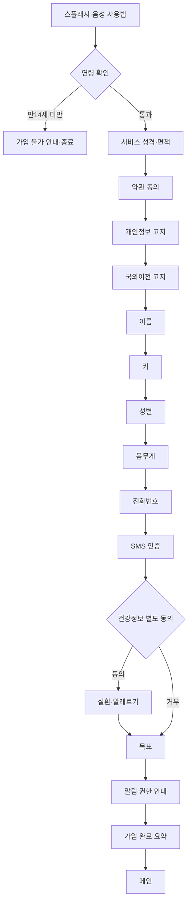

# 04. 화면 설계 · UI/UX 흐름

> 기준 디자인: Figma `see-sun 화면구성 2차`의 「26-1 3차 의뢰 운동식단」(1016:2061), 「식단기록페이지」(758:4142), 「마이페이지」(844:1696), 「수정본」(104:499), 「26-1 3차 의뢰 복약기능」(1009:2848), 1차 화면 「프론트엔드 개발」(345:725).
> 화면 ID 규칙: `영역-번호`(예: ONB-03). Figma 노드 ID를 병기하고, **Figma에 없는 화면은 "신규"**로 표시합니다.

## 1. 정보 구조 (IA)

```
앱 시작
 ├─ 스플래시(음성 사용법·TalkBack 확인)                        [신규]
 ├─ 온보딩(최초 1회) ─ 연령 확인 → 서비스 성격·면책 → 약관 → 개인정보 고지 → 국외이전 고지
 │                    → 이름 → 키 → 성별 → 생년월일 → 몸무게 → 전화번호 → SMS 인증
 │                    → 건강정보 별도 동의 → (동의 시) 질환·알레르기 → 목표 → 알림 권한 안내 → 가입 완료 요약
 └─ 메인 ─┬─ 식단 ─┬─ 식사 기록 ─┬─ 음성 기록(날짜→끼니→음식명→섭취량→추가 여부→확인)
          │        │             └─ 촬영 기록(촬영→확인)
          │        ├─ 식사 추천 ─ 영양소 / 알레르기 / 질환 / 선호 식단 → 음식 카드 → 음식 상세
          │        └─ 레포트 ─ 오늘의 식단 점수 / 식단 통계(주간·월간)
          ├─ 운동 ─ 운동 방식(근력·유산소·유연성·균형·추천 루틴) → 운동 목록 → 운동 상세·재생
          │         └─ 나만의 루틴(목록·생성·수정)
          ├─ 약(3차) ─ 복약 홈 ─┬─ 약 등록 ─ 신규(음성·촬영·직접 입력 7단계 → 등록 요약) / 등록된 약 관리
          │                    └─ 복약 통계 ─ 오늘 / 주간 / 월간
          ├─ 마이페이지 ─ 건강 정보 수정 / 기록 레포트(식단·운동)
          └─ 설정 ─ 음성 안내 / 물리 버튼 / 건강 정보 / (3차) 복약 알림 / 개인정보·동의 관리 / 데이터 출처·라이선스 / 접근성 안내 / 문의하기 / 계정
복약 알림(푸시) → 알림 전체화면
```

## 2. 화면 목록과 Figma 매핑

### 2.1 공통·온보딩
| ID | 화면 | Figma | 비고 |
|---|---|---|---|
| SPL-01 | 스플래시·음성 사용법 | 1차 INIT(345:961) 참고 | 신규 문구, TalkBack 켜짐 감지 |
| LGL-01 | 연령 확인(생년월일 먼저) | **신규** | 만 14세(또는 18세) 미만 차단, 값 비저장 |
| LGL-02 | 서비스 성격·면책("의료기기 아님") | **신규** | 요지 낭독, 전문 선택 청취 |
| LGL-03 | 이용약관 동의 | **신규** | 요약→전문 듣기→동의 |
| LGL-04 | 개인정보 수집·이용 고지 | **신규** | 항목·목적·보유기간 |
| LGL-05 | 위탁·국외이전 고지 | **신규** | D-04 결정에 따라 내용 변동 |
| ONB-01~06 | 이름/키/성별/생년월일/몸무게/전화번호 × 4상태 | 1031:2840~3036 (1차 345:726~347:1621) | 2차 검증 규칙 적용 |
| ONB-07 | SMS 인증(자동 입력) | **신규** | 자동 채움 시 음성 알림, 실패 시 키패드 |
| LGL-06 | 건강정보(민감정보) 별도 동의 | **신규** | **거부 시 일반 모드**로 진행 |
| HLT-01 | 질환·알레르기 음성 입력 | 1031:3673 | [버튼으로 설정] |
| HLT-02 | 질환및알레르기 선택 | 1031:3692 | |
| HLT-03 | 질환 선택 | 1031:3700 | 복수 선택 |
| HLT-04 | 질환 확인 | 1031:3780 | [확인][수정] |
| HLT-05 | 알레르기 선택(스크롤 강조 목록) | 1031:3748 | **이전/다음 버튼 추가**(COM-09) |
| HLT-06 | 기타 알레르기 | 1031:3743 | |
| HLT-07 | 알레르기 확인 | 1031:3806 | |
| HLT-08 | 목표 설정 | 1031:3678 | |
| LGL-07 | 알림 권한 안내 | **신규** | just-in-time 가능 |
| ONB-08 | 가입 완료 요약 | **신규** | 동의 항목 요약 낭독 |

### 2.2 메인·마이페이지·설정
| ID | 화면 | Figma | 비고 |
|---|---|---|---|
| MAIN-01 | 메인(2×2 + 설정) | 1031:3818 | Figma에 [설정] 버튼 없음 → 추가 |
| MY-01 | 마이페이지 | 845:2184 (845:2150·2162) | [건강 정보 수정] |
| MY-02 | 건강 정보 수정 | **신규**(ONB·HLT 재사용) | 현재 값 먼저 낭독 |
| MY-03 | 운동 주간 리포트 | **신규** | 횟수·시간 낭독 |
| SET-01 | 설정 목록 | **신규** | 목록형 버튼 |
| SET-02~09 | 음성 안내 / 물리 버튼 / 복약 알림(3차) / 개인정보·동의 관리 / 데이터 출처·오픈소스 / 접근성 안내 / 문의하기 / 계정(초기화·탈퇴 2단계) | **신규** | 견적 분리 대상(2차 §8) |

### 2.3 식단
| ID | 화면 | Figma | 비고 |
|---|---|---|---|
| DIET-01 | 식단 메뉴 | 1031:3842 | |
| DREC-01 | 식사 기록 방식 선택 | 1021:3798 | |
| DREC-02 | 기록 날짜(음성/달력 모드) | 730:1632, 976:1776 외 | 미래 날짜 차단 |
| DREC-03 | 끼니 | 758:3774, 758:3803 | 현재 시간대 끼니 기본 강조(1차 기획) |
| DREC-04 | 음식 이름 | 758:3927 외 | |
| DREC-05 | 섭취량 | 758:4042 외 | |
| DREC-06 | 추가 여부 | 758:4120 | |
| DREC-07 | 기록 확인(음성 기록) | **신규**(1021:3777 레이아웃 재사용) | 끼니·음식·양·kcal 낭독 |
| DREC-08 | 촬영 기록 | 1021:3807 | 위치 안내 음성 |
| DREC-09 | 촬영 기록 확인 | 1021:3777 | 끼니 질문 |
| DREC-10 | 알레르기 경고 팝업 | **신규** | [대체 식단 보기][확인] |
| DREC-11 | 당류 지표 경고 팝업 | **신규** | [추천 음식 보기][확인] → "이대로 기록할까요?" |
| DRCM-01 | 식사 추천 메뉴 | 1031:3870 | |
| DRCM-02 | 영양소 선택 → 결과 | 1031:3888 → 1031:3900 | 단백질·지방은 같은 템플릿 |
| DRCM-03 | 알레르기 선택 → 대체 식단 | 1031:3999 → 1034:4085 | 주의 문구 |
| DRCM-04 | 질환 주의 식품 → 당뇨/고혈압 | 1034:4133 → 1034:4145 | 고혈압은 같은 템플릿 |
| DRCM-05 | 선호 식단 | 1034:4192 | |
| DRCM-06 | 음식 상세 | **신규** | [오늘 식사에 추가][선호 식단 저장] |
| DRPT-01 | 레포트 메뉴 | 1021:2203 | |
| DRPT-02 | 오늘의 식단 점수 | 1021:3171 | 막대 → 상세·추천 이동, [운동하러 가기] |
| DRPT-03 | 식단 통계 메뉴 | 1021:2220 | |
| DRPT-04 | 주간 / 월간 통계 | 1021:3401 / 1021:3446 | **낭독용 목록 병행**, 기간 이동 버튼 |
| DRPT-05 | 항목별 상세(3대 영양소 막대 등) | **신규** | |

### 2.4 운동 (1차 기능 Android 재구현)
| ID | 화면 | Figma | 1차 코드 대응 | 개선 포인트 |
|---|---|---|---|---|
| EX-01 | 운동 방식 | 231:708 / 489:1492 | `/exercise` | 목표 기반 정렬(EX-08) + 이동 알림 |
| EX-02 | 단일/루틴 선택 | 345:792, 489:1549 | `/exercise/single`, `/routine` | |
| EX-03 | 운동 목록(스크롤 강조) | 11:629 / 489:1622 | `ExerciseSwiper` | **스와이프 전용 → 이전/다음 버튼·포커스 가능 항목**(A4) |
| EX-04 | 운동 상세·재생 | 318:741, 231:735 / 489:1634·1661 | `[ex_type]/[sport_pk]`, `ExercisePlayback` | 컨트롤 레이블(A2), 문장 싱크(NFR-04), 배속·되감기·자막 토글 |
| EX-05 | 루틴 연속 재생(휴식·다음 안내) | **신규** | `routine/[ex_type]/[sport_pk]` | 전환 매니저(EXERCISE_005) |
| EX-06 | 나만의 루틴 목록·생성·수정 | 546:1551, 566:1536, 359:1506, 367:1438, 566:1578, 566:1620, 566:1625 | `/exercise/custom/*` | **싱글/더블탭 제스처 제거 → 명시 버튼**(A5) |
| EX-07 | 운동 안전 확인(첫 운동) | **신규** | - | PAR-Q+ 요약, 보조자 필요 운동 표시 |

### 2.5 복약 (3차)
| ID | 화면 | Figma | 비고 |
|---|---|---|---|
| MED-01 | 복약 홈 | 1001:1714 | "염분 섭취 주의" 제거, [복용 완료]→[복용 기록], [되돌리기] |
| MED-02 | 알림 전체화면 | 1001:1788 | "염분 X" 칩 제거, [복용 기록][10분 뒤 다시 알림] |
| MED-03 | 약 등록 메뉴 | 996:1918 | |
| MED-04 | 신규 약 등록(방식 선택) | 951:1779 | |
| MED-05 | 음성 등록 | 996:1742 → 996:1800 → 996:1828 | DB 후보 최대 3개 |
| MED-06 | 촬영 등록 | 1001:1748 | "처방전 영역"→"약봉투" |
| MED-07 | 직접 입력 1~7단계 | 1008:1740, 1009:2960, 3065, 3149, 3173, 3194/3810, 3215, 3236 | 빈도는 드롭다운 대신 큰 버튼 5개, 6/7 종료일 버튼 신규 |
| MED-08 | 등록 요약 | 1008:1724 | [이대로 등록 완료][음성으로 수정] |
| MED-09 | 등록된 약 관리 | 1009:1875 | "주의 카테고리" 제거 |
| MED-10 | 약 상세 | **신규** | [수정][복용 중단][삭제] |
| MED-11 | 복약 기록 메뉴 / 오늘 / 주간 / 월간 | 951:1749 / 1008:1756 / 1008:1770 / 1008:1784 | "사용자 기록 기준" 표기 |
| MED-12 | 복약 알림 설정 안내(정확한 알람→전체화면→잠금화면 표시) | **신규** | 거부 시 대체 방식 안내 |

**신규 화면 합계(2차):** 약 25개, **(3차):** 약 3개 → 2·3차 의뢰서 모두 "Figma에 없는 화면 디자인은 견적 분리" 조항 해당.

## 3. 핵심 흐름

### 3.1 온보딩(법적 화면 포함)

- 생년월일은 연령 확인 단계에서 받은 값을 **본인 동의 후** 프로필로 재사용(중복 입력 제거). 연령 확인 전에는 저장하지 않음.
- 건강정보 거부 사용자: 식단 점수의 질환·알레르기 항목은 "해당 없음", 경고·대체 식단 비활성, 설정에서 언제든 동의 가능.

### 3.2 식사 음성 기록
```mermaid
flowchart TD
  S[식사 기록] --> A[날짜: 오늘/어제/달력] --> B[끼니] --> C[음식 이름] --> D[섭취량]
  D --> E{영양 DB 매칭}
  E -- 복수 --> E2[대표 1인분 선택·이름 낭독] --> F
  E -- 없음 --> E3[유사 음식 후보 또는 '영양정보 없음' 기록] --> F
  E -- 1건 --> F{더 기록할 음식?}
  F -- 네 --> C
  F -- 아니요 --> G[확인 화면 낭독]
  G --> H{알레르기 포함?}
  H -- 예 --> H1[알레르기 경고: 진동·팝업·음성 → 대체 식단 이동 가능] --> I
  H -- 아니오 --> I{당류 지표 높음 이상? (당뇨 선택자)}
  I -- 예 --> I1[당류 경고: 진동 패턴·팝업 → 추천 음식 이동 가능] --> J
  I -- 아니오 --> J{이대로 기록할까요?}
  J -- 네 --> K[로컬 저장 → 동기화 · 짧은 진동 '저장했어요'] --> L[점수 재계산]
  J -- 아니요/수정 --> C
```

### 3.3 촬영 기록
촬영(탭 또는 바코드 자동) → ML Kit 실시간 탐지·위치 안내 → [바코드] 제품 조회 / [영양성분표] OCR 값 우선 / [원재료명] 알레르기 우선 안내 / [포장 없음] 음식명 음성 입력 → 끼니 질문 → 확인 화면 → 3.2의 경고·저장 단계와 동일. 인식 실패: "인식하지 못했어요" [다시 촬영][음성으로 기록].

### 3.4 운동 → 식단·마이페이지 연동
- 메인[운동] → EX-01. 목표에 따라 카테고리 순서 조정 + "선호하시는 유산소 메뉴를 먼저 보여드려요" 안내.
- 식단 점수에서 칼로리 110% 초과 → [운동하러 가기] → EX-01(목표 기반) 또는 추천 루틴.
- 마이페이지[운동] → 주간 횟수·시간(세션 is_valid 기준) 낭독.

### 3.5 복약 루프(3차)
등록(음성/촬영/직접) → 등록 요약 확인 → 스케줄 생성(AlarmManager) → 정시 알림(전체화면 허용 시 전체화면, 아니면 고우선 알림) → [복용 기록]/[10분 뒤] → 30분 무응답 재알림 → 다음 회차 시 누락 확정 → 통계.

## 4. 화면 공통 규칙 (디자인·접근성)

| 항목 | 규칙 |
|---|---|
| 레이아웃 | 360×740 기준, 세로 스크롤, 글꼴 확대(200%)에서 잘림 없음 |
| 색 | 배경 #241BA2, 기본 버튼 #FFFF53(검정 2px, r16, 폭 320), 보조 #FF383C, 비활성 어두운 노랑, 강조 문구 노랑 |
| 헤더 | 상단 60px 아래 80px, 뒤로가기(레이블 "뒤로 가기") + 흰색 제목 40px |
| 터치 영역 | 최소 48dp, 카드 전체가 히트 영역 |
| 포커스 | 화면 진입 시 제목에 포커스 → 제목·단계 안내 → 첫 행동 요소. 팝업은 포커스 트랩 |
| 음성 | TalkBack 켜짐: 앱 TTS 중단, 접근성 알림으로 전달. 꺼짐: 앱 TTS(설정 속도). 안내 중 사용자가 조작하면 즉시 중단 |
| 자동재생 | 진입 안내와 마이크 자동 시작을 **동시에 하지 않음**(1차 A9). 마이크는 안내 종료 후 사용자 조작으로 시작(설정으로 자동 시작 선택 가능) |
| 목록 | 스크롤 강조 목록: 가운데 항목 확대·낭독 + **[이전][다음] 버튼**, 각 항목은 포커스 가능한 버튼 |
| 상태 | 색 + 텍스트 + 아이콘 + 음성(예: "녹음 중", "복용함/예정/누락") |
| 오류 문구 | 한국어, 행동 제안 포함("인터넷 연결을 확인해 주세요" + [다시 시도]) |
| 그래프 | 모든 차트에 낭독용 목록/요약 텍스트 병행 |

## 5. 음성 문구 원칙과 예시

- 구조: **[화면/상태] + [핵심 정보] + [다음 행동]**. 예: "식사 기록, 2단계. 식사 종류를 말씀해 주세요. 아침, 점심, 저녁, 간식 중에서 고를 수 있어요."
- 확인: "아침, 떡볶이 한 그릇, 480킬로칼로리. 맞으면 확인, 고치려면 수정이라고 말씀해 주세요."
- 경고 접두어로 종류 구분: "알레르기 주의. …", "당류 지표 높음. …".
- 면책 꼬리말(질환·경고 단계): "영양 정보에 오차가 있을 수 있어요. 정확한 정보는 전문가와 상담하세요."
- 문구 전체 목록(스크립트 시트)은 설계 v1.0에서 화면 ID별로 작성 → 기획팀 검수.

## 6. Figma 수정 요청 목록 (디자인팀 전달용)

1. 메인에 [설정] 버튼 추가(2차 §3).
2. 스크롤 강조 목록(알레르기·운동 목록)에 [이전][다음] 버튼 추가.
3. "당뇨 위험도" 문구·등급 표기 변경(D-06 결정 후).
4. 신규 화면 25+3개(§2의 "신규") 디자인 — 동의·고지, SMS 인증, 설정 하위, 음식 상세, 경고 팝업, 기록 확인, 운동 안전, 약 상세, 알림 설정 안내.
5. 복약: "처방전 영역"→"약봉투", "염분 X"·"염분 섭취 주의"·"주의 카테고리" 삭제, 빈도 드롭다운→큰 버튼 5개, 종료일 버튼, [복용 완료]→[복용 기록].
6. 예시 값(1999-12-34, 00점 등)은 실제 형식 예시로 교체.
